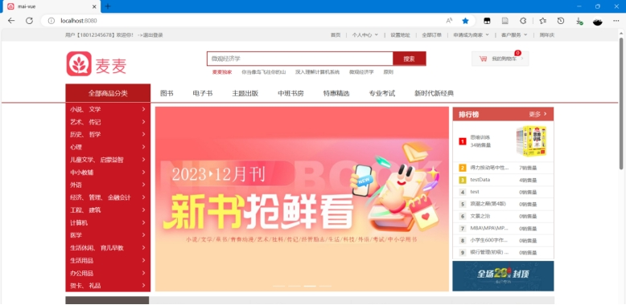

# 麦麦书城

## 基本介绍

基于SpringBoot+Shiro+Redis的网上书城，前端采用Vue，持久层采用MySQL。分为前台用户商城和后台管理系统。是我的大三期末项目。

前台用户商城具有注册、登录、搜索商品、加入购物车、结算、订单签收、评价、修改个人信息和地址等功能。
后台管理系统具有用户管理、评论管理、商品管理、订单管理等功能，采用ElementUI框架+Vue3实现。

## 安装

- 本项目使用的JAVA版本为`1.8.0_121`，Nodejs版本`v16.14.2`

- 需要自行安装redis

- 导入数据库文件 并在中修改数据库密码

- （前端项目我暂未上传github）前端部分需要安装Node的依赖模块（node_modules)：在前端项目的终端输入`npm install`

## 运行

- 运行项目前要先打开redis

- 后端部分：在IDEA中运行application类启动项目

- 前端部分：前端项目的终端输入 `npm run dev` 运行项目。在浏览器按`F12`打开控制台，`Ctrl+Shift+M`开启设备仿真，可以选择iPhone SE等尺寸

## 技术栈介绍

- 总体：springboot+vue
- 前端：vue、element-ui、vue-element-admin
- 后端：springboot、mybatis-plus、shiro、jwt、redis

## 项目演示

### 1. 核心功能介绍

游客点进注册界面，输入手机号、密码和邮箱，点击“提交”按钮后，数据库验证手机号是否重复，重复则提醒游客“手机号重复”注册失败，成功则跳转到商城首页并进入登录状态，具体如图所示。

 

#### 商家添加/更新图书功能实现

商家通过后台管理系统进行添加图书，在侧边栏点击“添加/更新商品”，选择商品图片，填写各项信息，点击“添加”按钮后，商品、相关作者、相关图片集添加进数据库，页面跳转回“查看商品”页面，点击“更新”即可看到商品详细信息，也可再对其进行更新。添加/更新图书界面如图所示。

 

 

 

 

 

### 2. 其它功能介绍

1、主页界面

 

2、搜索浏览商品

 

 

3、添加商品到购物车

 

4、搜索浏览商品评论并添加到购物车

 

 

4、结算购物车

 

5、添加收货地址

 

 

 

6、提交订单

 

 

7、待商家发货后可以点击收货

 

8、评论已收货订单的商品

 

 

9、查看自己刚刚发表的评价

